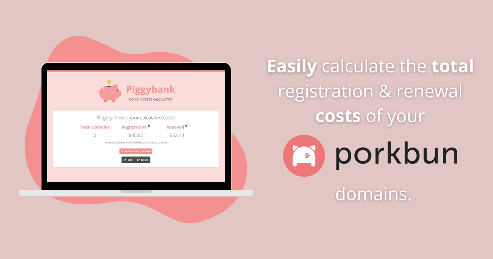

# 🐷💰 <span style="color: #f49090;">Piggybank</span> &bull; Porkbun Domain Costs Calculator



[](https://github.com/SamKirkland/FTP-Deploy-Action)

I used to have a domain name addiction (and still kind of do... but, hey, baby steps!) with Porkbun being my registrar of choice.

While their prices and overall experience is good, there didn't seem to be an easy way to see how much your total renewal costs would be for the year, which I personally really wanted so I'd be able to budget accordingly.

**Introducing <span style="color: #f49090;">Piggybank</span>** 🐖 ~ a simple-to-use web app that allows you to easily calculate the total registration and renewal costs of your Porkbun domains.

All you need to do is copy-and-paste your [simple list](https://porkbun.com/account/domainList) of domains from Porkbun (or if you're just brainstorming, type in any domain offered by Porkbun) into the box on [the homepage](https://piggybank.jj15asmr.com) and hit "Calculate".

Your total registration and renewal costs will then be calculated and displayed for you to marvel at. 🤩

> This repository contains the full source code for Piggybank which is open-sourced under the MIT License - see the [LICENSE](LICENSE.txt) file for details. Piggybank is not affiliated with Porkbun LLC and was made for fun.

## How It Works

Porkbun allows you to view a plain text or "simple" list of your currently registered domains as well as offers a public API for accessing their pricing data.

Piggybank is set up to make an API request twice per week (Tuesdays and Fridays) for this pricing data which is then stored in the database.

When you copy-and-paste your list of domains into the box, it is then parsed to extract the [TLD](https://www.cloudflare.com/learning/dns/top-level-domain/) (top-level domain or it's "extension") from each indvidual domain name which is then finally used to calculate the total registration and renewal costs using the stored pricing data.

*Please note that because registration and renewal prices for domains can and will fluculate over time due to registry changes or special offers, the calculated costs should be seen more as an estimation or "ballpark" figure to help you budget your domains.*

## Installation

You can setup and run Piggybank yourself by following the below instructions:

1. Download (and extract) or clone Piggybank's repository to your local machine or server.

2. Enter Piggybank's directory and via the terminal execute the following commands:
    ```bash
    composer install

    cp .env.example .env

    php artisan key:generate
    ```

3. In the ``.env`` file ensure that your database details are correct and then run the below command:
    ```bash
    php artisan migrate
    ```

    Your database should now be filled with the required tables.

4. To fetch and store the current domain prices from Porkbun run the below command (Porkbun currently offers around 800 different TLDs, so it may take a minute):
    ```bash
    php artisan piggybank:get-domain-prices
    ```

5. If you'd like the domain prices to be automatically fetched and stored as described in the "How it Works" section you'll need to do the following:

    - In the ``.env`` file, set the ``PIGGYBANK_EMAIL_TO_SEND_TO_ON_FAILURE`` key to a valid email address. The details of any failed API requests will be sent there.

    - Add the below CRON entry to your server/machine (this process may vary depending on your OS and any hosting control panel you may be running in addition, use Google if you're unsure):
        ```bash
        * * * * * cd /path/to/piggybank && php artisan schedule:run >> /dev/null 2>&1
        ```

        The automatic fetch is powered by Laravel's built-in task scheduler and so it might be helpful to view [it's documentation](https://laravel.com/docs/10.x/scheduling) if you'd like to modify things further.

6. Lastly, ensure that the ``APP_URL`` and ``ASSET_URL`` keys in the ``.env`` file are correct for your case and then run the below command to host Piggybank locally on your machine:
    ```bash
    php artisan serve
    ```

    Go to the URL given in your browser and you should be all set! Enter in some domains to calculate the costs for and have fun!

### Running Tests

Piggybank, as any good project should 😉, includes automated tests powered by PHPUnit. You can run them by running the below command:

```bash
php artisan test --order-by random
```

If you'd like to view or edit the tests you can find them all within the ``tests/Unit`` and ``tests/Feature`` directories, organized accordingly.

Any tests that involve the DB are configured to use an in-memory SQLite database, if you'd like to change this, you can do so in the ``phpunit.xml`` file in the project's root.

## Credits

I built Piggybank using these awesome things made by awesome people, here's a big thanks to them:

* [Porkbun API](https://porkbun.com/api/json/v3/documentation)
* [Laravel](https://github.com/laravel/laravel)
* [Livewire](https://github.com/livewire/livewire)
* [PHPUnit](https://github.com/sebastianbergmann/phpunit)
* [Laravel Money](https://github.com/cknow/laravel-money)
* [Bootstrap](https://github.com/twbs/bootstrap)
* [Font Awesome](https://github.com/FortAwesome/Font-Awesome)
* [Animate.css](https://github.com/animate-css/animate.css)
* [Bunny Fonts](https://fonts.bunny.net/)
* [Fesliyan Studios](https://www.fesliyanstudios.com) (for logo sound effects)

And an honorable mention to [this article](https://laraveldaily.com/post/money-laravel-php-best-practices) on Laravel Daily that helped me with how to handle storing and displaying the domain prices. 

## Extra Notes

I've only been working with Laravel since last November. 😁 If you spot anything wrong with my code or it's design then please feel free to submit an issue or PR. I'd really appreciate it.
